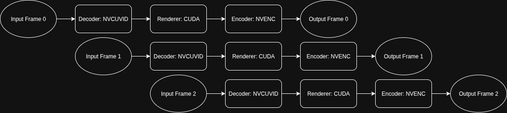
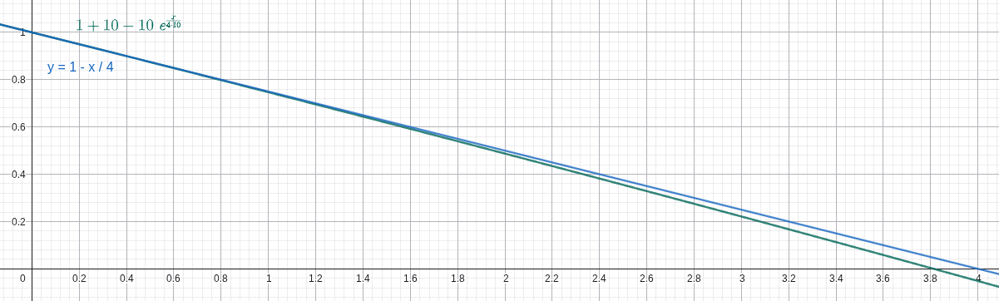

# **StarTrailCUDA: GPU-Accelerated Rendering of Night-Sky Star Trails Video** - Milestone Report

**Team Members:** Zijun Yang <zijuny@andrew.cmu.edu> and Jiache Zhang <jiachez@andrew.cmu.edu>

**Project Home Page:** [https://blog.zjyang.dev/StarTrailCUDA/](https://blog.zjyang.dev/StarTrailCUDA/)

<a href="https://www.bilibili.com/video/BV1Q64y1a7FE/?share_source=copy_web&vd_source=248bf19a901960bb7bbfb1705c664b9c&t=79">https://www.bilibili.com/video/BV1Q64y1a7FE/?share_source=copy_web&vd_source=248bf19a901960bb7bbfb1705c664b9c&t=79</a>

## SUMMARY

zjc

## BACKGROUND

zjc

## APPROACHES AND RESULTS

### EXPERIMENT SETUP

zjc

### RENDERING ALGORITHMS

#### MAX

zjc

#### LINEAR

zjc

#### LINEARAPPROX

zjc

### IMPLEMENTATIONS

#### BASELINE

zjc

#### BASELINE WITH HARDWARE CODEC

zjc

#### CUDA

zjc

#### CUDA + PIPELINE

In the CUDA approach, the video data flows through three conceptual stages:

- **Decode:** The process begins with compressed video packets. These packets are decoded to produce raw video frames. Each packet contains encoded information for a segment of the video, and decoding transforms this data into a usable frame format.

- **Render:** The raw frames are then processed to generate output frames with the desired star trail effects. Each input frame is transformed into an output frame, where the visual effect is applied.

- **Encode:** Finally, the processed output frames are re-encoded into compressed video packets.

Each stage utilizes a different part of the GPU: decoding uses the video decoding circuit, rendering uses CUDA cores, and encoding uses the video encoding circuit. In the basic CUDA approach, while one stage is active, the other hardware components remain idle.

This underutilization motivates the use of a pipeline, where decoding, rendering, and encoding are performed concurrently. By overlapping these stages, the pipeline keeps all GPU components busy, significantly improving overall throughput and reducing idle time for each hardware unit. In a pipelined approach, while frame N is being decoded, frame N+1 can be rendered, and frame N+2 can be encoded, all at the same time.

Given that the decode stage is the most time-consuming stage in the CUDA implementation, costing 19553ms, a naive three-stage pipeline would be limited by this duration. However, we decompose the workflow into five distinct concurrency units, which allows further parallelization and avoids being limited by the giant decode stage:

1. **Packet Reader**: Reads compressed video packets (H.264/HEVC/VP9/AV1) from disk to host memory
2. **Hardware Decoder**: Transforms compressed packets from host memory to NV12 format on GPU
3. **Renderer**: Applies star trail effects using CUDA kernels on GPU (maintains NV12 format)
4. **Encoder**: Compresses rendered NV12 frames on GPU to H.264 packets
5. **File Writer**: Writes compressed H.264 packets from host memory to output video file on disk

Stages are connected by thread-safe queues that enable asynchronous communication between pipeline components, decoupling processing rates and maintaining data flow.

The following pipeline table illustrates how frames progress through different stages over time, showing the overlapping nature of the 5-stage pipeline:

|         | 1   | 2   | 3   | 4   | 5   | 6   | 7   | 8   | 9   |
| ------- | --- | --- | --- | --- | --- | --- | --- | --- | --- |
| Frame 1 | PR  | DE  | RE  | EN  | WR  |     |     |     |     |
| Frame 2 |     | PR  | DE  | RE  | EN  | WR  |     |     |     |
| Frame 3 |     |     | PR  | DE  | RE  | EN  | WR  |     |     |
| Frame 4 |     |     |     | PR  | DE  | RE  | EN  | WR  |     |
| Frame 5 |     |     |     |     | PR  | DE  | RE  | EN  | WR  |

Where: PR=Packet Reader, DE=Hardware Decoder, RE=Renderer, EN=Encoder, WR=File Writer

Additionally, the CUDA implementation originally used RGB format for frames, requiring transfers between CPU and GPU for format conversion. This caused NV12→RGB→NV12 conversions (CPU→GPU→CPU→GPU) that wasted significant time and bandwidth. To optimize this, we modified the renderer to process NV12 frames directly, keeping frames in GPU memory from decode to encode without unnecessary transfers.

This results in a massive performance improvement with a runtime of 4.6s, which is a ~250x speedup compared to the baseline implementation.

**Detailed Timing Breakdown:**

| Operation         | Time per frame (us) |
| ----------------- | ------------------- |
| **Decoder**       |                     |
| Packet read       | 213                 |
| Decode            | 548                 |
| GPU transfer      | 1585                |
| Output queue push | 8557                |
| **Renderer**      |                     |
| Input queue pop   | 2                   |
| Render            | 1227                |
| Output queue push | 2                   |
| **Encoder**       |                     |
| Input queue pop   | 368                 |
| GPU transfer      | 444                 |
| Encoding          | 90                  |
| Packet queue push | 4                   |
| Write             | 106                 |

**Total frames**: 444

However, we found the result to be confusing:

From the renderer's 2us pop and 2us push on input and output queue, we are sure that the renderer should be the bottleneck. This means that the decoder was waiting for the renderer to take the next frame and the encoder was waiting for the renderer to give the next frame, so there was little time the renderer spent on waiting. However, other stages take way more time than the 1227us the renderer takes per frame and 1227us x 444 frames does not equal 4.6 seconds.

Examining our code, we found that we only included the computational time in the rendering phase, and not all the other construction and destruction steps which include malloc and free.

We added logs on those items as well and the result was as follows:

**Detailed Timing Breakdown with Memory Operations:**

| Operation         | Time per frame (us) |
| ----------------- | ------------------- |
| **Decoder**       |                     |
| Read              | 98                  |
| Decode            | 637                 |
| Memory alloc      | 1363                |
| GPU transfer      | 544                 |
| Output queue push | 8090                |
| **Renderer**      |                     |
| Input queue pop   | 3                   |
| Memory alloc      | 0                   |
| Render            | 1291                |
| Memory free       | 8547                |
| Output queue push | 3                   |
| **Encoder**       |                     |
| Input queue pop   | 451                 |
| Frame alloc       | 2                   |
| GPU transfer      | 406                 |
| Encoding          | 128                 |
| Packet queue push | 4                   |
| Memory free       | 9343                |
| Write             | 130                 |

This indicates that the current bottleneck is indeed the renderer and the key issue was the excessive number of memory operations.

#### CUDA + PIPELINE + ZERO COPY + BUFFER POOL

yzj

## LIST OF WORK BY EACH STUDENT AND DISTRIBUTION OF TOTAL CREDIT

| Task                                       | Assigned To              |
| ------------------------------------------ | ------------------------ |
| **Exploring rendering algorithms**         |                          |
| MAX                                        | Jiache Zhang             |
| AVERAGE                                    | Jiache Zhang             |
| EXPONENTIAL                                | Jiache Zhang             |
| LINEAR                                     | Jiache Zhang             |
| LINEARAPPROX                               | Zijun Yang               |
| **Implementations**                        |                          |
| Baseline                                   | Jiache Zhang             |
| Baseline with hardware codec               | Jiache Zhang, Zijun Yang |
| CUDA                                       | Zijun Yang               |
| CUDA + pipeline                            | Zijun Yang               |
| CUDA + pipeline + zero copy + buffer pool  | Zijun Yang, Jiache Zhang |
| **Brainstorming, testing and documenting** | Zijun Yang, Jiache Zhang |

Credit should be distributed 50-50.

milestone:

---

## LIST OF WORK COMPLETED SO FAR

We explored different star trail algorithms:

- MAX: The MAX algorithm maintains an accumulated per-pixel maximum with a small decay so that bright pixels persist as trails. (Jiache Zhang)
- AVERAGE: The AVERAGE algorithm sums frames within a sliding window and outputs the per-pixel average, equally combining recent frames. (Jiache Zhang)
- EXPONENTIAL: The EXPONENTIAL algorithm maintains an exponential moving average of frames ($\text{acc} = (1-\alpha) * \text{acc} + \alpha * \text{frame}$); however, it is hard to control the tail length. (Jiache Zhang)
- LINEAR: The LINEAR algorithm keeps a fixed-size deque of recent frames and applies linearly decreasing weights with element-wise maxima across weighted frames. The cost of LINEAR algorithm is $O(window size)$. (Jiache Zhang)
- LINEARAPPROX: Uses mathematical heuristics to approximate the LINEAR algorithm with $O(1)$ cost instead of $O(window size)$ to render each frame. (Zijun Yang)

We explored different implementations:

- Baseline: The baseline implementation is a CPU-based, serial decode–render–encode pipeline built with OpenCV that serves as our correctness reference and performance benchmark; it exposes decoding/encoding and per-frame rendering as the primary bottlenecks on high-resolution inputs. (Jiache Zhang)
- Baseline with hardware codec: Similar to baseline, but with both video decoding and encoding replaced with hardware-accelerated implementations (using NVENC for encoding and CUVID for decoding) for improved performance. (Jiache Zhang and Zijun Yang)
- CUDA: Similar to baseline with hardware codec, but with the rendering phase replaced with pixel-wise parallelism using CUDA kernels for high-performance computation of star trail effects. (Zijun Yang)

## PRELIMINARY RESULTS

> **NOTICE: Most videos on this page are in 4K. If you notice any aliasing, viewing it in full screen usually helps.**

> Unless otherwise stated, the results are from an AWS EC2 g4dn.xlarge instance (4 vCPUs, 16GB RAM, NVIDIA T4, gp2 storage with 100 IOPS) running LINEARAPPROX algorithm with default parameters.

### RENDERING ALGORITHMS

#### Source Material Selection

Our source material is a high-quality all-night sky recording (non-time-lapse) from YouTube (video source: <https://www.youtube.com/watch?v=Bbp1-p2FoXU>). This video provides excellent clarity and resolution (3840×2160), making it ideal for rendering star trail videos.

We considered alternative sources, particularly examining the database at <https://data.phys.ucalgary.ca/>, which contains comprehensive continuous nighttime recordings from observatories worldwide over recent years. While this database offers extensive and complete data, it presents a significant limitation: the cameras are primarily scientific instruments designed for research purposes rather than high-quality cinematography, resulting in insufficient clarity for star trail rendering. Therefore, we opted for clear videos recorded by amateur astronomy enthusiasts.

#### Video vs. Image Format Consideration

Theoretically, using video files versus collections of individual images as source media would yield equivalent results. However, storing media in image format requires prohibitively large storage space. Our test video, when stored as an MP4 file, occupies 101.77MB. When each frame of this video is saved in PNG format, the total storage requirement reaches 18GB; even with JPEG compression, it still requires 3.6GB. This storage demand is unacceptable for development and testing environments with limited storage capacity (for example, GHC servers impose a 2GB storage limit per user, insufficient for image-format media storage). Mounting remote storage would introduce additional I/O overhead.

Consequently, we decided to store and process source media in video format to minimize local storage requirements. Additionally, MP4-compressed video maintains sufficient quality without affecting final rendering results, eliminating the need for uncompressed video or image inputs.

<video width="100%"   controls muted autoplay loop>
  <source src="https://github.com/zpatronus/StarTrailCUDA/raw/refs/heads/main/docs/videos/source.mp4" type="video/mp4">
  Your browser does not support the video tag.
</video>
Test video from Drew Cotten: <a href="https://www.youtube.com/watch?v=Bbp1-p2FoXU">https://www.youtube.com/watch?v=Bbp1-p2FoXU</a>

#### MAX Algorithm

<video width="100%"   controls muted autoplay loop>
  <source src="https://github.com/zpatronus/StarTrailCUDA/raw/refs/heads/main/docs/videos/max.mp4" type="video/mp4">
  Your browser does not support the video tag.
</video>
MAX Algorithm

The MAX algorithm creates star trails by maintaining a cumulative maximum frame that preserves the brightest pixel values encountered over time. At each frame, the algorithm performs an element-wise maximum operation between the current input frame and the accumulated maximum frame, ensuring that bright stars leave persistent trails while darker background regions remain unaffected.

Key implementation details:

- **Decay Factor**: A decay factor of 0.999 is applied to the accumulated frame before comparison, causing older trails to gradually fade and preventing infinite accumulation of brightness values
- **Pixel-wise Maximum**: For each pixel position, the algorithm selects the maximum value between the decayed accumulated frame and the current frame: `maxFrame = max(maxFrame × 0.999, currentFrame)`

While this approach is conceptually simple and straightforward to implement, the practical results are suboptimal. The decay factor of 0.999 is insufficient to prevent excessive accumulation of brightness values over time. As the video progresses, bright points fade too slowly, causing an increasing number of luminous artifacts to persist in the frame. This leads to severe overexposure and blurring effects, where the accumulated trails become overly bright and lose definition. The resulting star trail video appears washed out with poor contrast and indistinct trail boundaries, making it difficult to discern individual star trajectories. Although the MAX algorithm successfully demonstrates the basic concept of trail preservation, its aggressive retention of bright pixels without adequate decay control produces unsatisfactory visual quality.

#### LINEAR Algorithm

<video width="100%"   controls muted autoplay loop>
  <source src="https://github.com/zpatronus/StarTrailCUDA/raw/refs/heads/main/docs/videos/linear.mp4" type="video/mp4">
  Your browser does not support the video tag.
</video>
LINEAR Algorithm

The LINEAR algorithm produces the highest quality star trail effects among all tested approaches by implementing a sophisticated sliding window technique with linear weight decay. This method maintains a fixed-size window of recent frames and applies linearly decreasing weights to create natural-looking trail fade effects.

Key implementation details:

- **Sliding Window**: Maintains a deque of the most recent W frames (where W is the window size), automatically removing the oldest frame when the window is full
- **Linear Weight Decay**: Applies weights ranging from 1.0 (most recent frame) to 1/W (oldest frame in window), creating a smooth linear fade: `weight = (W - i) / W`
- **Pixel-wise Maximum**: For each frame position, performs element-wise maximum operation between the weighted frame and the accumulated result: `accFrame = max(accFrame, weightedFrame)`

This approach produces visually superior results with well-defined star trajectories, appropriate trail lengths, and natural fade characteristics. The linear weighting ensures that recent star positions are prominent while older positions gradually diminish, creating realistic motion blur effects that closely resemble long-exposure photography techniques.

However, the algorithm's computational complexity is significantly higher due to the need to maintain and process the entire sliding window for each output frame. In our serial implementation, the LINEAR algorithm requires approximately 1125 seconds to complete rendering, making it impractical for real-time or near-real-time applications. The performance bottleneck stems from the intensive memory operations and repeated maximum computations across the sliding window, highlighting the critical need for parallel optimization techniques.

#### LINEARAPPROX Algorithm

In the LINEAR algorithm, it is very expensive both in memory and computation to trace back $W$ input frames to calculate a single output frame, given that an ideal effect requires a window size of 30 to 120. To improve this, our first idea was to use exponential decay since it only needs the last output frame and the new input frame to generate the new output frame. However, it is very hard to control the tail length using exponential decay and the visual effect tends to be that the head is too bright while the tail is too dark.

To solve this issue, we leverage the fact that the exponential function has a derivative of 1 near $x=0$ and we can approximate a LINEAR decay with the following formula:

$$y=1+L-L e^{\frac{x}{WL}}$$

, where $L$ is some number larger than 5 and a greater $L$ gives a better approximation.

Here's a comparison between the ground truth (the blue line) and our heuristic (the green line) under $W=4$ and $L=10$.

With this heuristic, the new output frame can be approximated using only the last output frame and the new input frame using this formula in $O(1)$:

$$NewOutputFrame=\max\left((L+1)-(L+1-LastOutputFrame)e^{\frac{1}{LN}},NewInputFrame\right)$$

<video width="100%"   controls muted autoplay loop>
  <source src="https://github.com/zpatronus/StarTrailCUDA/raw/refs/heads/main/docs/videos/linearapprox.mp4" type="video/mp4">
  Your browser does not support the video tag.
</video>
LINEARAPPROX Algorithm

The LINEARAPPROX algorithm looks very similar to the LINEAR algorithm in controlling the tail length and window size except for being slightly darker. We suspect the difference mainly comes from floating point precision and rounding errors. Also, both of us think it actually looks better than the LINEAR algorithm because it emphasizes bright stars and suppresses the darker ones, creating a cleaner video.

In the baseline implementation, we compared the performance difference for the LINEAR algorithm and the LINEARAPPROX algorithm under default parameters given the test input ($W=30$). The LINEAR algorithm takes 1125s to complete while the LINEARAPPROX only takes 152s, which is a huge 7.4x speedup gifted by math.

<video width="100%"   controls muted autoplay loop>
  <source src="https://github.com/zpatronus/StarTrailCUDA/raw/refs/heads/main/docs/videos/linearapprox_90w.mp4" type="video/mp4">
  Your browser does not support the video tag.
</video>
LINEARAPPROX Algorithm with a window size of 90 frames

### BASELINE RENDERER

The baseline implementation serves as our reference CPU-based serial processing pipeline, built entirely around the OpenCV library for comprehensive video processing operations. This implementation provides a clean, modular architecture that handles video input, frame-by-frame rendering computations, and video output encoding in a sequential manner.

Architecture Overview:

- **Frame Reader Module**: Implements a `FrameReader` class hierarchy that abstracts video input sources, supporting both video files and image folder sequences. The module handles frame extraction, format conversion, and provides a unified interface for accessing sequential video frames regardless of the input format.
- **Video Renderer**: Contains the core rendering logic with support for multiple star trail algorithms (MAX, LINEAR, LINEARAPPROX, etc.). The renderer processes frames sequentially on the CPU, applying the selected algorithm to generate star trail effects through pixel-wise operations and accumulation techniques.

The baseline serves as both a correctness reference and a performance benchmark against which optimized implementations are measured. While this approach ensures maximum compatibility across different hardware configurations, it suffers from multiple performance bottlenecks. Beyond the purely serial nature of the rendering computations, the OpenCV-based software video decoding and encoding operations themselves become major time bottlenecks. In certain rendering algorithms, the combined decode and encode time can match or even exceed the algorithm computation time, making video I/O processing as critical a performance constraint as the rendering logic itself. For high-resolution 4K video inputs, these compounded inefficiencies result in total processing times extending to several hundred seconds.

**Performance Results:**

Average time: 152.33s

**Timing Breakdown from a Typical Run:**

| Stage  | Time (ms) | Percentage |
| ------ | --------- | ---------- |
| Decode | 4,531.59  | 3.0%       |
| Render | 112,786   | 73.7%      |
| Encode | 35,687.5  | 23.3%      |
| Total  | 153,005   | 100%       |

Comparing to LINEAR algorith, LINEARAPPROX has a speed up of approximatly 7.4x. As shown in the timing result above, the encode stage in the baseline consumes a non-negligible fraction of total runtime and therefore represents a clear optimization opportunity.

### BASELINE RENDERER WITH HARDWARE CODEC

Given that it takes a long time to encode output frames to output videos as seen in the baseline, and that we plan to use NVIDIA GPU, we leverage NVIDIA's codec library to decode and encode videos using hardware acceleration.

**Performance Results:**

Average time: 133.07s

**Timing Breakdown from a Typical Run:**

| Stage  | Time (ms) | Percentage |
| ------ | --------- | ---------- |
| Decode | 13,023.2  | 9.8%       |
| Render | 111,430   | 84.4%      |
| Encode | 7,673.19  | 5.8%       |
| Total  | 132,127   | 100%       |

The implementation shows significant improvement in encoding time compared to the baseline (reduced from 35.7s to 7.7s), demonstrating the efficiency of hardware-accelerated video processing.

The speedup so far is 8.5x

It is pretty clear that the bottleneck now is the rendering time.

### CUDA RENDERER

This implementation replaces the sequential CPU-based rendering computations with GPU-accelerated CUDA kernels that execute pixel-wise operations in parallel, dramatically reducing the rendering computation time.

**Performance Results:**

Average time: 40.94s

**Timing Breakdown from a Typical Run:**

| Stage  | Time (ms) | Percentage |
| ------ | --------- | ---------- |
| Decode | 19,553.5  | 39.1%      |
| Render | 12,100.1  | 24.2%      |
| Encode | 18,316.9  | 36.7%      |
| Total  | 49,970.4  | 100%       |

The CUDA implementation dramatically improves rendering time with a 9.2x speedup (from 111.4s to 12.1s). The total speedup compared to the original baseline reaches 27.4x.

Can we improve from here? Yes! We're working on it. Please refer to the PLAN FOR THE NEXT WEEK part.

## CURRENT CONCERNS

No major concerns. Just a matter of coding and doing the work. The main concern is our unfamiliarity with video codecs and their respective SDKs. There might be some pitfalls, but so far the progress looks good.

## PLAN FOR THE NEXT WEEK

Over the next week we will focus on a three-stage processing pipeline (decode → render → encode) so decoding, rendering and encoding can proceed concurrently. The goal is to overlap work across stages to substantially reduce end-to-end runtime for the current test dataset, with a target near 10 seconds.

We will proceed incrementally: first validate overlap with a small buffered design, then implement a full producer–consumer pipeline and measure improvements. Each step will include timing checks and visual verification to ensure we gain performance without changing output quality. Jiache ang Zijun will do the development and testing together.

## EXPECTED DELIVERABLES AT THE END

We will provide a pipeline-optimized CUDA implementation together, as well as the baseline, the baseline-with-hardware-codec and the cuda versions. The deliverables will include the original source video and rendered output videos and runtime results from algorithms and implementations for direct comparison.
